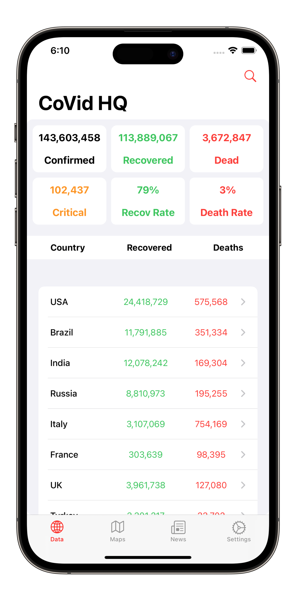
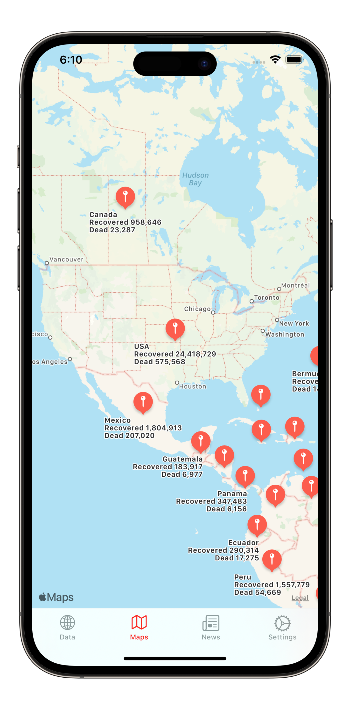
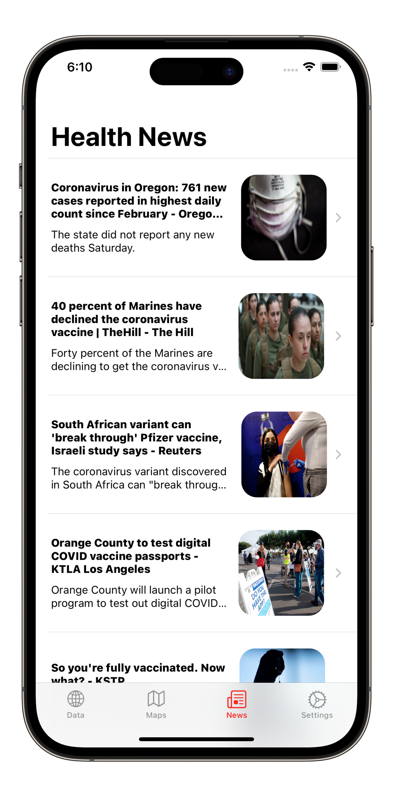

<h1 align="center">
    
    <br />
    <b>CoVid HQ | COVID-19 Tracking App</b>
</h1>

<div align="center">
    <a href="https://www.buymeacoffee.com/paulRoden">
        
    </a>
    <a href="https://github.com/RodenPaul86/CoVid-HQ/blob/main/LICENSE">
        
    </a>
</div>

<br />

<p align="center">
    <a href="#features">Features</a>
    •
    <a href="#features">Requirements</a>
    •
    <a href="#features">Getting-Started</a>
    •
    <a href="#screenshots">Screenshots</a>
    •    
    <a href="#support">Cocoapods</a>
    •
    <a href="#support">Support</a>
    •
    <a href="#license">License</a>
</p>

## Features

- Ad free.
- Current stats for different countries.
- Map with recovered and deceased stats.
- Health news.

## Requirements

- Xcode 14.3.1
- iOS 16 / macOS Big Sur

## Getting-Started

- Clone or Download
- Build and Run

## Screenshots

<div align="left">
    
    </a>    
    
    </a>    
    
    </a>    
</div>

## Cocoapods
```ruby
// Podfile
target 'CoVid HQ' do
  use_frameworks!
  pod 'Alamofire'
  pod 'SwiftyJSON'
  pod 'SwiftUIRefresh'
end
```

## Support

I embarked on my journey as an independent developer, and CoVid HQ marked one of my initial ventures as I delved into the realm of Software Development almost 10 years ago as of 2023. Witnessing its remarkable evolution since then has been truly inspiring. Amidst numerous side projects I've undertaken, CoVid HQ has remained my unwavering focal point.

As I strive to uphold CoVid HQ with a continuous stream of innovative features, refinements, and meticulous bug fixes, I am genuinely touched by the unwavering support of my incredible community. Your backing would mean the world to me, ensuring that CoVid HQ continues to flourish.

<p><a href="https://www.buymeacoffee.com/paulRoden"> </a></p><br><br>
<br/>

Thank you!

## License
CoVid-HQ is written in (Swift 5) and is distributed under the terms of the [Apache License](https://github.com/RodenPaul86/CoVid-HQ/blob/main/LICENSE) (Version 2.0).
