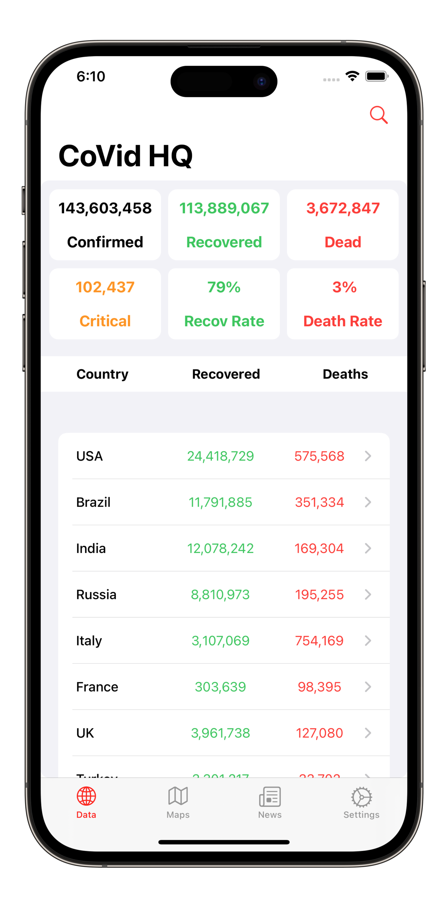
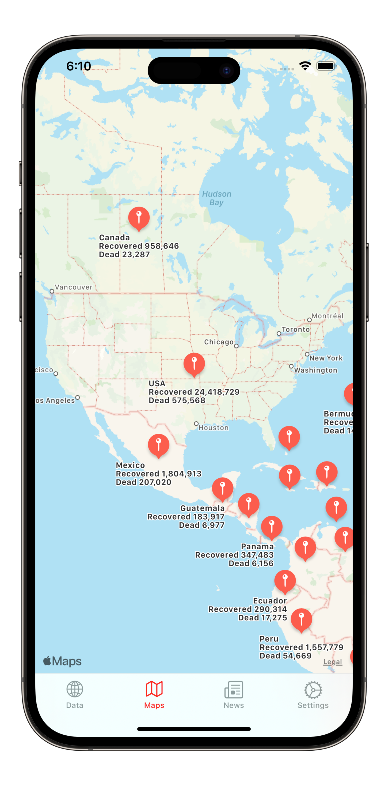
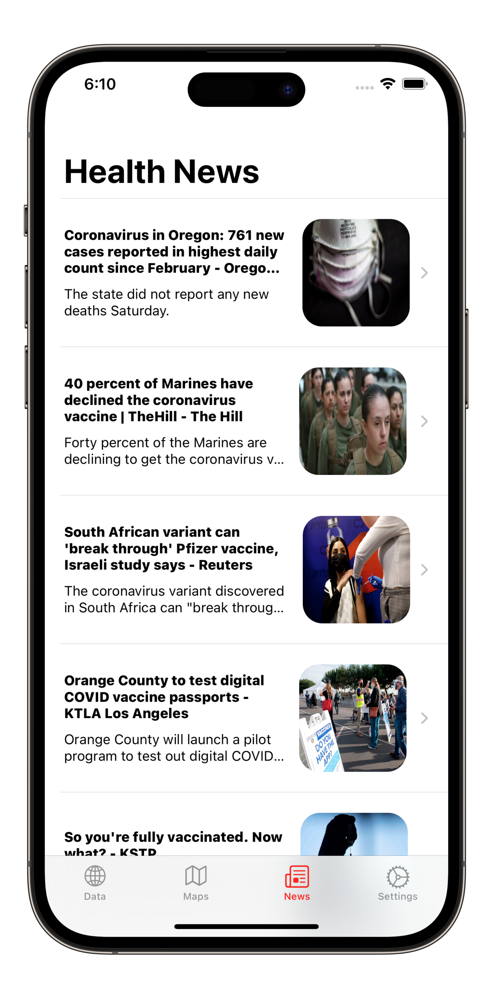

<h1 align="center">
    
     
    <b>CoVid-HQ | Covid-19 Tracking App</b>
</h1>

    
    

 

    <a href="#download">Download</a>
    •
    <a href="#features">Features</a>
    •
    <a href="#screenshots">Screenshots</a>
    •    
    <a href="#support">Support</a>
    •
    <a href="#license">License</a>

## Download

    <h4><b>You can get CoVid-HQ from the link below!</b></h4>
    

## Features

- Light/dark mode toggle
- Live previews
- Fullscreen mode
- Cross platform

## Screenshots

    
    </a>    
    
    </a>    
    
    </a>    

## Support

  
  

## License
CoVid-HQ is written in (Swift 5) and is distributed under the terms of the [Apache License](https://github.com/RodenPaul86/CoVid-HQ/blob/main/LICENSE) (Version 2.0).
